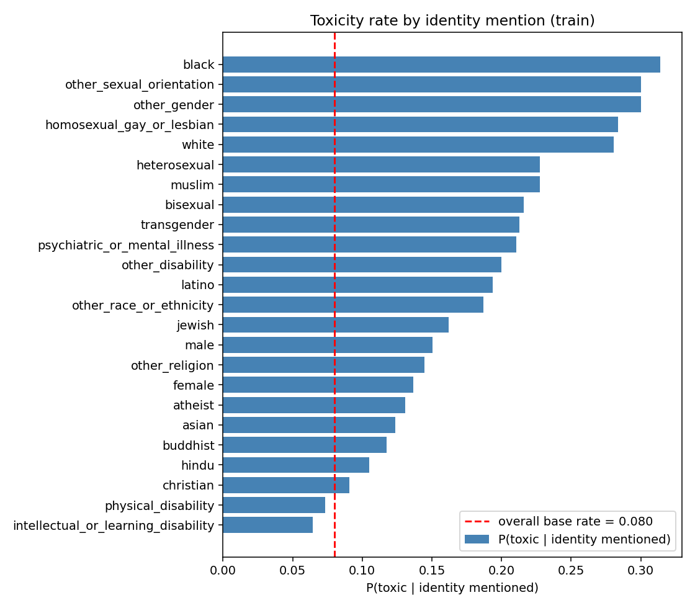
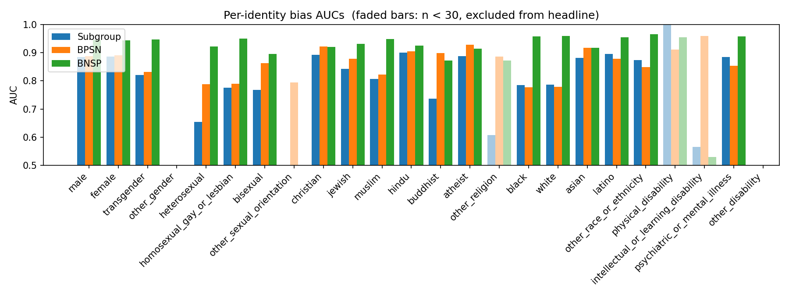

# Project report — Toxic-comment classification

## 1. Problem framing

The Jigsaw Unintended Bias in Toxicity Classification dataset contains
1,804,874 online comments labelled with continuous toxicity scores in
`[0, 1]`, plus per-comment scores for 24 identity dimensions (e.g.
`male`, `muslim`, `black`, `psychiatric_or_mental_illness`). The binary
classification target is `toxic = (target >= 0.5)`.

The "Unintended Bias" framing addresses a known failure mode of
toxicity classifiers: a model trained only to maximise overall
accuracy learns to flag comments that mention identities which are
disproportionately the target of toxic content in the training data
(e.g. "muslim", "gay"), because the surface tokens co-occur with the
positive class above the base rate (see §2). The competition metric, which this repo also implements,
decomposes into three per-identity Receiver Operating Characteristic
Area Under Curve (ROC-AUC) variants — *Subgroup AUC*,
*Background-Positive Subgroup-Negative AUC* (BPSN), and
*Background-Negative Subgroup-Positive AUC* (BNSP) — and combines them
via a generalised power mean with exponent `p = -5`, which is dominated
by the weakest identity. This penalises the
"mention-an-identity → predict-toxic" shortcut directly.

The model is a **pre-Layer-Normalisation Transformer encoder** built
from scratch (no pretrained weights). The HuggingFace `tokenizers`
library is used only as a Byte-Pair Encoding (BPE) trainer over the
Jigsaw training text — the vocabulary is learned from the dataset; no
pretrained vocabulary is loaded.

## 2. Data analysis

The full reproducible analysis is in [`scripts/eda.py`](scripts/eda.py);
the resulting tables, log, and plots are committed under
[`docs/results/eda/`](docs/results/eda/). This section keeps only the
findings that drove a concrete modelling or engineering decision.
Throughout, `qN` denotes the Nth percentile (e.g. `q95` = 95th percentile).

**Schema.** 1,804,874 rows × 45 columns, in five families: `id`,
`comment_text`, `target` + 6 sub-toxicity scores, 24 identity scores
(annotated on only 22.4 % of rows), and engagement / publication
metadata. The held-out test set is the union of
`test_public_expanded.csv` and `test_private_expanded.csv` (194,640
labelled rows). The unlabelled `test.csv` is not used.

**Target distribution.** Heavily skewed: mean 0.103, median 0,
95th percentile 0.6. 70.07 % of rows have `target` exactly 0; 8.00 %
have `target ≥ 0.5` (the binary positive class); 11.5 % sit in
`[0.3, 0.7]`, where annotators disagreed. Decision: set the
`pos_weight` of `BCEWithLogitsLoss` (binary cross-entropy with logits)
to `N_neg / N_pos ≈ 11.5` to compensate for class imbalance.

**Identity-mention vs. toxicity.** Conditional toxic rate
P(toxic | identity mentioned) compared to the 8.0 % base rate:

| Identity                   | P(toxic \| mentioned) | Lift over base |
|----------------------------|----------------------:|---------------:|
| black                      |                  31 % | 3.9×           |
| homosexual_gay_or_lesbian  |                  28 % | 3.5×           |
| white                      |                  28 % | 3.5×           |
| muslim                     |                  23 % | 2.8×           |
| transgender                |                  21 % | 2.7×           |

A bag-of-words classifier exploiting these tokens would score well on
overall ROC-AUC but poorly on Background-Positive Subgroup-Negative AUC
(which measures false-positive bias on identity-mentioning comments).
This is the failure mode the competition metric was designed to detect.



**Identity sparsity and co-occurrence.** Only 22.4 % of rows are
identity-annotated; six identities have fewer than 100 mentions in
train. The most-common co-mention pairs (`male & female`,
`black & white`, `christian & muslim`) confirm that identity labels are
multi-label rather than categorical. Decision: split train/val with
multi-label stratification on `(toxic, identity-presence)` via
`iterstrat.MultilabelStratifiedShuffleSplit`
(`src/toxic_classifier/data/split.py`) so the val set retains
representative coverage of rare identities.

**Comment length.** Length percentiles are: characters median 202,
q95 953, max 1906; whitespace-separated tokens median 35, q95 159;
post-BPE subword tokens q95 ≈ 120. Decision: set `max_len = 128` in
`configs/base.yaml`. Doubling `max_len` to 256 would cover only the
longest 5 % of comments at roughly 4× the attention compute (attention
is quadratic in sequence length).

**Sub-toxicity Pearson correlations with `target`:**
`insult` 0.93, `obscene` 0.49, `identity_attack` 0.45,
`severe_toxicity` 0.39, `threat` 0.29, `sexual_explicit` 0.25.
Decision: `insult` is near-synonymous with the binary target and adds
little auxiliary signal; the other four are weakly-to-moderately
correlated and are good candidates for an auxiliary multi-task head
(see §10).

**Train vs. test distributional drift.** Positive rates are within
0.06 percentage points (8.00 % train, 7.94 % test). All identity
mention rates agree within ±10 % except
`intellectual_or_learning_disability` (2.4× more frequent in test;
n = 24 absolute) and `atheist` (1.9× more frequent). The class-prior
match means no test-time re-weighting is required; the rare-identity
discrepancies show up as noise in the per-identity bias metric (§7).

**Annotator counts.** The median number of toxicity annotators per row
is 4 (90th percentile 10), so each `target` value is the mean of
roughly 4 binary judgements and therefore quantised at multiples of
~0.25. This is one source of label noise; it motivates the future-work
item of weighting training rows by `toxicity_annotator_count` (§10).

## 3. Splitting strategy

The test split is **frozen**: the union of `test_public_expanded.csv` and
`test_private_expanded.csv` (194,640 rows). It is not read during training
or model selection.

Train and val are split 95/5 from `train.csv`, stratified on a multi-label
vector formed by:

- the binary toxic label, and
- one bit per identity column (mentioned vs. not, at the same 0.5 threshold).

The split uses `iterstrat.MultilabelStratifiedShuffleSplit`. Multi-label
stratification is preferred over single-label stratification on the
toxic flag because the val set is evaluated per-identity (see §7);
single-label stratification leaves rare-identity subgroup sizes to
chance and inflates val-time variance on the per-identity metrics.

The unit test in `tests/test_split.py` asserts no row-id overlap between
splits and that the split is reproducible from a fixed seed.

## 4. Tokenisation

A byte-level BPE tokeniser with vocabulary size 30,000 is trained on the
Jigsaw training text only, using Unicode NFKC normalisation and
lowercasing. Three special tokens are reserved: `[PAD]` (id=0),
`[UNK]` (id=1), `[CLS]` (id=2). `[CLS]` is prepended at encode time;
the pooled representation is its final hidden state by default.

### On-the-fly vs. pre-tokenised

Two `Dataset` implementations are provided:

- `RawJigsawDataset` (mode `raw`): reads a CSV into memory at
  construction and tokenises lazily in `__getitem__`. Used by the smoke
  test, unit tests, and any ad-hoc CSV.
- `MemmapJigsawDataset` (mode `memmap`): reads pre-tokenised token ids
  from a `uint16` memory-mapped binary, with sidecar arrays for per-row
  lengths, labels, raw targets, and identities.

For full-scale training the pipeline pre-tokenises once via
`make prepare` and stores the result as memmap. Justification:

1. **Per-epoch CPU work is near-zero.** Tokenising 1.8 M comments
   inside `DataLoader` workers takes 30–60 seconds per epoch even with
   `tokenizers`' native parallelism; this is wall-clock time the GPU
   spends idle. Reading a `uint16` memmap is at native disk-cache
   throughput.
2. **Identical inputs across epochs.** Pre-tokenising eliminates a
   source of run-to-run variance. The smoke pipeline is also bit-stable
   because the smoke vocabulary file is committed.
3. **Disk footprint is small.** 1.8 M comments × ~80 tokens × 2 bytes
   ≈ 280 MB — smaller than the source CSV.
4. **Reuse.** A given prepare run is fully determined by the config, so
   multi-run / multi-config training amortises the one-time cost.

The trade-off is one additional pipeline step (`make prepare`) before
`make train` for a fresh dataset.

The `collate_fn` dynamically pads each batch to the longest sequence in
that batch rather than to `max_len`, which avoids wasted attention
compute on short comments.

Class imbalance is handled by `BCEWithLogitsLoss(pos_weight=N_neg/N_pos)`
by default; an alternative `WeightedRandomSampler` path is available
behind `cfg.train.use_weighted_sampler`.

## 5. Model architecture

The encoder block (`src/toxic_classifier/model/transformer.py`) has the
pre-Layer-Normalisation residual form:

```
x →  x + Dropout( Attention( LayerNorm(x) ) )
  →  x +          FeedForward( LayerNorm(x) )
```

with `Attention = nn.MultiheadAttention(batch_first=True)`, padding
handled via `key_padding_mask` (`True` marks padded positions); and
`FeedForward = Linear(d, dim_ff) → GELU → Dropout → Linear(dim_ff, d) → Dropout`.

`ToxicClassifier` (`src/toxic_classifier/model/classifier.py`):

```
ids ─► nn.Embedding(vocab, d) × √d + nn.Embedding(max_len, d)
     ─► Dropout → N × PreLNEncoderBlock → final LayerNorm
     ─► [CLS] hidden state (or masked mean over non-pad positions)
     ─► nn.Linear(d, 1)
```

**Why pre-Layer-Norm rather than post-Layer-Norm.** With pre-LN, the
residual path passes `x` through unchanged at every block; the
LayerNorm sits inside the residual branch. At initialisation, the
residual stream therefore has unit gradient magnitude regardless of
depth, and training is stable without aggressive learning-rate warmup.
Post-LN places the LayerNorm after the residual addition, which couples
gradient magnitudes to depth and typically requires a long warmup phase
to converge. For a 4-layer from-scratch model the stability difference
matters more than the small final-quality edge sometimes reported for
post-LN. Reference: Xiong et al., "On Layer Normalization in the
Transformer Architecture", ICML 2020.

**Configurations:**

| Config | d_model | n_heads | n_layers | dim_ff | max_len | vocab  | parameters |
|--------|--------:|--------:|---------:|-------:|--------:|-------:|-----------:|
| smoke  |      64 |       2 |        2 |    128 |      64 |  4,096 |     0.33 M |
| base   |     256 |       4 |        4 |  1,024 |     128 | 30,000 |     10.9 M |

**Initialisation.** Linear and embedding weights are initialised from a
truncated normal with standard deviation 0.02; biases are zero; LayerNorm
weights are 1, biases 0. This matches the original BERT initialisation.

## 6. Training

Implementation: `src/toxic_classifier/train.py`.

- **Optimiser.** AdamW with β₁ = 0.9, β₂ = 0.98. Weight decay is 0.01
  on weight matrices and 0.0 on biases and LayerNorm scales. (Decaying
  LayerNorm scales would pull them towards zero, which empirically
  slows convergence; this no-decay convention is standard for
  Transformers.)
- **Learning-rate schedule.** Linear warmup for `cfg.train.warmup_steps`
  steps, then cosine decay to zero over the remaining steps. Default
  warmup is 1,000 steps in `configs/base.yaml`.
- **Mixed precision.** Automatic Mixed Precision (AMP) via
  `torch.amp.autocast` + `GradScaler`, enabled when training on CUDA
  and disabled on CPU (so the smoke run is exact-precision).
- **Gradient clipping.** Global L2 norm clipped to 1.0.
- **Gradient accumulation.** Configurable via
  `cfg.train.grad_accum_steps`; default 1.
- **Checkpointing.** Two files per run: `best.pt` (the epoch with the
  highest value of `cfg.train.best_metric`, which defaults to the
  Jigsaw bias metric on val — see §7) and `last.pt`. Each file contains
  the model state, the full config it was trained with, and that
  epoch's val metrics. `eval.py` and `infer.py` reconstruct the model
  from the checkpoint's stored config; no separate architecture file is
  required.
- **Logging.** Weights & Biases (`wandb`). Per step: `train/loss`,
  `train/acc`, `train/lr`. Per epoch: `val/loss`, `val/auc`,
  `val/pr_auc`, `val/acc@0.5`, `val/jigsaw`, plus
  `train/epoch_loss` and `train/epoch_acc`. Smoke and CI runs set
  `WANDB_MODE=disabled` so they require no W&B account.
- **Multi-GPU.** `torchrun --nproc_per_node=N -m toxic_classifier.train`
  enables `DistributedDataParallel` and a `DistributedSampler` for the
  training set. Single-GPU is the default; `configs/base.yaml` is sized
  for one GPU.
- **Determinism.** `set_seed(seed, deterministic=cfg.train.deterministic)`
  seeds Python's `random`, NumPy, and PyTorch (CPU and CUDA). Setting
  `train.deterministic: true` additionally calls
  `torch.use_deterministic_algorithms(True)` and sets
  `torch.backends.cudnn.deterministic = True`. This is opt-in because it
  can reduce throughput.

## 7. Evaluation

`eval.py` reports two groups of metrics:

- **Threshold-free ranking quality.** Overall Receiver Operating
  Characteristic AUC (ROC-AUC) and Precision-Recall AUC (PR-AUC), plus
  accuracy at a fixed operating threshold (`cfg.eval.threshold`,
  default 0.5).
- **Jigsaw bias-aware metric.** For each of the 24 identities, three
  ROC-AUC variants are computed:
  - **Subgroup AUC** — ROC-AUC restricted to comments that mention the
    identity. Measures within-subgroup ranking quality.
  - **BPSN AUC** (Background-Positive, Subgroup-Negative) — ROC-AUC
    over the union of (toxic comments NOT mentioning the identity) and
    (non-toxic comments that DO mention it). Detects false positives
    triggered by identity-mention.
  - **BNSP AUC** (Background-Negative, Subgroup-Positive) — symmetric.
    Detects false negatives on toxic content directed at the identity.

  Each per-identity AUC array is reduced with a generalised power mean
  of exponent `p = -5` (defined as `(mean(v^p))^(1/p)`; for `p < 0`
  this is dominated by the smallest input, so a single weak subgroup
  drives the result down). The headline scalar is the weighted
  arithmetic mean of overall ROC-AUC and the three reduced
  per-identity quantities, with weight 0.25 on the overall ROC-AUC.

Both `train.py` (val-time selection) and `eval.py` (test reporting)
filter identities with fewer than `min_subgroup_n` examples (default
30) when computing the headline scalar; the per-identity table and
chart always include every identity. See §7's full-training subsection
for why this filter exists and how the rare tail is reported.

`eval.py` writes the following into `artifacts/<run>/eval/`:

- `metrics.json` — overall metrics, the headline Jigsaw scalar, the
  unfiltered Jigsaw scalar, the three reduced per-identity power-means
  (filtered and unfiltered), and the full per-identity table.
- `per_identity.csv` — flat per-identity table (all 24 identities).
- `per_identity_aucs.png` — bar chart of per-identity Subgroup / BPSN /
  BNSP AUCs. Bars for identities below `min_subgroup_n` are drawn at
  reduced opacity to mark them as not contributing to the headline.

### Full-training results

Configuration: `configs/base.yaml` — 8 epochs, AMP enabled, AdamW,
10.9 M parameters, 30,000-vocabulary BPE, `max_len = 128`, single
NVIDIA H100. Checkpoint selection uses
`cfg.train.best_metric = "jigsaw"`, i.e. the Jigsaw bias-aware metric on
val (rather than val ROC-AUC).

Per-epoch trajectory (W&B run:
[base-v3-jigsaw](https://wandb.ai/gvpatil-uw/toxic-classifier/runs/b8vq4xyx)):

| Epoch | train loss | train acc | val loss | val ROC-AUC | val acc@0.5 | val Jigsaw |
|------:|-----------:|----------:|---------:|------------:|------------:|-----------:|
|     0 |     0.6811 |    0.8541 |   0.6245 |      0.9319 |      0.8195 |     0.8706 |
|     1 |     0.6090 |    0.8678 |   0.6150 |      0.9362 |      0.8831 |     0.8789 |
|     2 |     0.5877 |    0.8705 |   0.6130 |      0.9365 |      0.8627 |     0.8797 |
|     3 |     0.5718 |    0.8739 |   0.6119 |      0.9386 |      0.8463 |     0.8814 |
|     4 |     0.5572 |    0.8766 |   0.6082 |      0.9383 |      0.8511 |     0.8790 |
| **5** | **0.5401** | **0.8803** | **0.6164** | **0.9407** | **0.8792** | **0.8834** ★ |
|     6 |     0.5231 |    0.8832 |   0.6323 |      0.9403 |      0.8833 |     0.8816 |
|     7 |     0.5103 |    0.8859 |   0.6364 |      0.9402 |      0.8836 |     0.8824 |

★ Epoch 5 is the maximum of `val Jigsaw` and is saved as `best.pt`.
Val loss reaches its minimum at epoch 4 and rises thereafter; val
ROC-AUC plateaus at 0.940; val Jigsaw still improves marginally to
epoch 5 before declining. Selecting on val Jigsaw therefore picks a
later epoch than selecting on val loss but a similar one to selecting
on val ROC-AUC, with a different tie-break behaviour on the rare-tail
subgroups.

**Filtering convention.** Both `val Jigsaw` and the headline test
Jigsaw apply `min_subgroup_n = 30`: identities with fewer than 30
examples in the eval set are excluded from the scalar reduction. This
is necessary because the `p = -5` power mean is dominated by its
smallest input, and a per-identity ROC-AUC computed on n = 24 has a
sampling standard error of approximately 0.07; without the filter, a
single noisy small subgroup can move the scalar by 0.05–0.10 across
runs with the same model. The per-identity table and chart are
unfiltered, so subgroups below the threshold remain visible in the
reporting.

**Test set.** Union of `test_public_expanded.csv` and
`test_private_expanded.csv` (n = 194,640). 18 of 24 identity subgroups
have n ≥ 30 in test and contribute to the headline scalar.

| Metric                                                      |  Value     |
|-------------------------------------------------------------|-----------:|
| Overall ROC-AUC                                             | **0.9417** |
| Overall PR-AUC                                              |     0.7020 |
| Accuracy @ 0.5                                              |     0.8807 |
| **Jigsaw bias metric (headline, n ≥ 30)**                   | **0.8839** |
| Subgroup-AUC power-mean (`p = -5`, n ≥ 30)                  |     0.8110 |
| BPSN-AUC power-mean (`p = -5`, n ≥ 30)                      |     0.8500 |
| BNSP-AUC power-mean (`p = -5`, n ≥ 30)                      |     0.9330 |
| Jigsaw bias metric (unfiltered, all 22 evaluable subgroups) |     0.8473 |

Full per-identity table is in `docs/results/per_identity.csv`. Bars for
subgroups with n < 30 are drawn faded in the chart:



**Common-identity subgroups (n ≥ 30, contribute to the headline).**
14 of 18 retained subgroups have Subgroup-AUC ≥ 0.80. The four below
that threshold split into two patterns:

- `homosexual_gay_or_lesbian` (n = 1,065, Subgroup 0.77),
  `bisexual` (n = 34, Subgroup 0.77), `black` (n = 1,519, Subgroup 0.79),
  and `white` (n = 2,452, Subgroup 0.79). For each, BNSP ≥ 0.95 (the
  model detects toxic content directed at the identity) but BPSN ≈ 0.78
  (the model also flags non-toxic comments that merely mention the
  identity). This is the false-positive bias the BPSN AUC is designed
  to detect.
- `heterosexual` (n = 141, Subgroup 0.65). Within-subgroup ranking is
  weaker; with n = 141 the AUC standard error is about 0.04, so the
  drop from 0.78 (the next-lowest common identity) is plausibly partly
  sampling noise.

**Rare-tail subgroups (n < 30, excluded from the headline).** Reported
for transparency:

| Identity                            |  n | Subgroup AUC | BPSN AUC | BNSP AUC |
|-------------------------------------|---:|-------------:|---------:|---------:|
| intellectual_or_learning_disability | 24 |         0.57 |     0.96 |     0.53 |
| other_religion                      | 29 |         0.61 |     0.89 |     0.87 |
| physical_disability                 |  9 |         1.00 |     0.91 |     0.95 |
| other_sexual_orientation            |  1 |          —   |     0.79 |       —  |
| other_gender                        |  0 |          —   |       —  |       —  |
| other_disability                    |  0 |          —   |       —  |       —  |

With these sample sizes a single misranked example moves Subgroup AUC
by approximately 1/n (4–10 percentage points), so the variance is
intrinsic. The point estimates are still informative for prioritising
the sample-weighting and auxiliary-head work in §10:
`intellectual_or_learning_disability` has BNSP = 0.53 on 24 test
examples, indicating that the model under-detects toxic content
directed at this identity. This is the most concrete target for the
identity-aware re-weighting work proposed in §10, even though the
subgroup is too small to move the headline scalar.

**Selection notes.** Epoch 5 is selected over epochs 6 and 7, all of
which have val ROC-AUC within 0.0005 of each other; the selection is
driven by `val Jigsaw` (0.8834 vs. 0.8816 vs. 0.8824). The same
`min_subgroup_n` is applied at val and test, so the metric optimised
during selection matches the metric reported here.

## 8. Inference

`src/toxic_classifier/infer.py` is a batched-inference command-line
tool: given a checkpoint, a tokenizer, and a CSV with a `comment_text`
column, it writes a copy of the CSV with an additional `toxic_score`
column (sigmoid of the model's output logit). It uses the same
dynamic-pad collate function as training. The `--num-workers` flag
controls CPU dataloading parallelism. End-to-end inference latency
and throughput are not measured in the current pipeline; adding a
benchmark mode is in §10.

Possible additional inference paths, all unimplemented at present:

- TorchScript or ONNX export of the model (`torch.onnx.export`),
- INT8 dynamic post-training quantisation of the linear layers,
- An HTTP server (e.g. FastAPI) wrapping `infer.py` for online use.

## 9. Software and packaging

- **Python package.** `src/toxic_classifier/` with `pyproject.toml` and
  three console scripts (`toxic-train`, `toxic-eval`, `toxic-prepare`).
  Editable install: `pip install -e .`.
- **Configs.** YAML, intentionally flat enough to be read at a glance.
  Per-key overrides: `--config configs/foo.yaml --set k.k=v` (each
  override repeated as `--set …`).
- **Tests.** `pytest` covers model forward shapes, padding-mask
  invariance, split reproducibility, no-leakage between splits, the
  bias-metric on a perfect predictor, the bias-metric filter behaviour,
  and an end-to-end smoke run. `tests/test_smoke.py` calls the same
  Python entry points as `make smoke` so the two cannot drift.
- **Lint.** `ruff` with the per-project ignore list `E501` (line length,
  handled by the formatter), `N806` (uppercase `B`/`L`/`D` for
  batch/seq/dim shapes), and `SIM115` (the `_open_writers` /
  `_close_writers` pattern in `prepare.py` is intentional).
- **Continuous Integration.** A workflow definition is committed at the
  repo root as `ci.yml.template`. Moving it into
  `.github/workflows/ci.yml` requires a Personal Access Token with the
  `workflow` scope; this is a one-step manual move and is not done in
  the current commit.
- **Secrets.** The Weights & Biases API key is read from the
  `WANDB_API_KEY` environment variable; it is never written into a
  config file or committed. The Personal Access Token used to push to
  GitHub lives only in `.git/config` (untracked) and should be rotated
  after the project is handed off.

## 10. Future work

In rough priority order:

- **Larger model and longer schedule.** Increase to `d_model = 384`,
  6 layers, 8 heads, batch size 512 (with gradient accumulation if
  needed), and 12 or more epochs. This stays within the no-pretrained-
  weights constraint and is expected to narrow the gap to fine-tuned
  pretrained baselines on the same dataset.
- **Identity-aware loss re-weighting.** Up-weight rows that mention
  rare identities and rows that are non-toxic-but-identity-mentioning
  (the BPSN failure case). This was a winning recipe in the original
  Jigsaw competition.
- **Sample weighting by `toxicity_annotator_count`.** The plumbing for
  this is already in `prepare.py` and `train.py` behind
  `cfg.data.sample_weight_col` and is a no-op when unset; turning it
  on requires only a config flip and a re-run of `make prepare`. The
  hypothesis is that high-confidence labels (10+ annotators) should
  contribute more gradient than low-agreement labels (median 4).
- **Auxiliary heads on the sub-toxicity columns.** `prepare.py` and
  `MemmapJigsawDataset` already plumb `cfg.data.auxiliary_targets`;
  a multi-task head on `identity_attack` and `obscene` would force the
  encoder to keep these axes distinct from the binary toxic score.
- **Focal loss / loss shaping.** With 8 % positives, focal loss
  typically gives a small but consistent improvement. The
  `_build_loss(cfg, pos_weight)` factory in `train.py` is the
  intended hook.
- **Distillation from a pretrained baseline.** Fine-tune a pretrained
  encoder (e.g. BERT-base) on the same data and use it as a teacher
  for a no-pretraining student. This serves both as a quality ceiling
  and as a regularised training signal.
- **Quantisation, ONNX export, and a latency benchmark.** Add INT8
  dynamic quantisation of the linear layers, an `--bench` mode in
  `infer.py`, and a small comparison table of throughput and latency
  across precisions.
- **Online-inference service.** Wrap `infer.py` in a FastAPI server
  with a `/predict` endpoint and report p50 / p99 latency.
- **Drift monitoring.** Online comment streams are non-stationary
  (vocabulary, slurs, and topic distributions all change over time).
  A scheduled job that re-evaluates the deployed model on a recent
  labelled sample and tracks per-identity AUCs over time would surface
  silent regressions.
- **Dataset additions.** Combining this dataset with the original
  Jigsaw Toxic Comment Classification Challenge corpus and Civil
  Comments improves robustness on the long-tail identities. Adding
  non-English data is a larger project.

## 11. Limitations

- **Single English-language dataset.** The model is trained on
  comments from one platform (Civil Comments), in English, dated
  2015-2017. It will not generalise to other languages, other
  platforms, or current slang without retraining.
- **Label noise.** Toxicity is annotator-subjective. Each `target` is
  the mean of approximately 4 annotators; 11.5 % of rows have
  `target ∈ [0.3, 0.7]`, where annotators disagreed. This sets an
  upper bound on accuracy at any fixed threshold that is below 100 %
  even for a perfect model.
- **The bias-aware metric is a proxy, not a fairness guarantee.** A
  high Jigsaw score certifies that, on the 24 identity columns in this
  dataset and at p = -5 power-mean weighting, the worst per-identity
  AUCs are above some threshold. It does not certify any operational
  fairness property (equality of false-positive rates across
  subgroups, calibration, disparate impact, etc.). A production
  fairness review would additionally require explicit operating-point
  metrics per subgroup, disparate-impact analysis, and qualitative
  evaluation by stakeholders.
- **No human evaluation.** ROC-AUC measures rank quality. It does not
  measure precision or recall at any particular operating threshold,
  nor whether a moderator would consider the model's decisions
  reasonable. Production deployment requires threshold tuning per use
  case and a downstream human-evaluation study.
